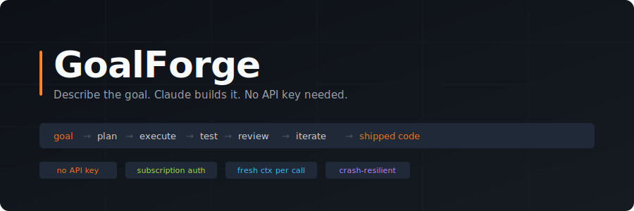

<div align="center">



<br/>
<br/>

**Type a goal. Walk away. Come back to working code.**

GoalForge runs an autonomous 6-phase loop powered by the Claude CLI —  
no API key, no billing dashboard, just your existing Claude subscription.

<br/>

[](https://nodejs.org)
[](https://docs.anthropic.com/en/docs/claude-code)
[](#license)

</div>

---

## How it works

```
you type a goal
      │
      ▼
  ┌─────────────────────────────────────────────────────────┐
  │                    GoalForge loop                       │
  │                                                         │
  │  ① PLAN      Sonnet breaks goal into atomic tasks       │
  │      │                                                  │
  │      ▼                                                  │
  │  ② EXECUTE   Claude writes files, runs commands         │
  │      │                                                  │
  │      ▼                                                  │
  │  ③ TEST      Jest runs; coverage is measured            │
  │      │                                                  │
  │      ▼                                                  │
  │  ④ REVIEW    Haiku checks diff for regressions          │
  │      │                                                  │
  │      ▼                                                  │
  │  ⑤ EXIT?     all tasks done · goal met · budget hit     │
  │      │  no → back to ①                                  │
  │      ▼  yes                                             │
  │  ⑥ MEMORY    state persisted, stale critiques removed   │
  │      │                                                  │
  │      ▼                                                  │
  │  ⑦ CLEANUP   tasks/cache/state wiped on success         │
  └─────────────────────────────────────────────────────────┘
      │
      ▼
  working code in your project root
```

Each phase runs as a **fresh claude subprocess** — no shared context window, no token bleed between calls. The state machine is typed TypeScript that survives crashes and resumes mid-task.

---

## Demo

```
$ cd ~/projects/my-react-app
$ goalforge "Add a dark mode toggle to the Settings page"

19:04:31  ⬡ GoalForge       GoalForge starting  {"goal":"Add a dark mode toggle...","maxIterations":20}
19:04:31  ◈ LoopController  === AUTONOMOUS LOOP STARTING ===
19:04:31  ◈ LoopController  Iteration 1
19:04:32  ◆ Planner         Phase: PLAN
19:04:47  ≡ TaskQueue       Tasks enqueued  {"count":4}
19:04:47  ▶ Executor        Phase: EXECUTE
19:04:47  ▶ Executor        Starting task  {"objective":"Add ThemeContext with dark/light mode state"}
19:05:14  ▶ Executor        Task complete  {"output":"Wrote src/context/ThemeContext.tsx, src/hooks/useTheme.ts"}
19:05:14  ▶ Executor        Starting task  {"objective":"Create DarkModeToggle component"}
19:05:39  ▶ Executor        Task complete  {"output":"Wrote src/components/DarkModeToggle.tsx"}
19:05:39  ✓ TestRunner      Phase: TEST  {"total":14,"passed":14,"failed":0,"coverage":"87%"}
19:05:53  ● Reviewer        Phase: REVIEW
19:06:07  ● Reviewer        Review result  {"score":91,"passed":true}
19:06:07  ◈ LoopController  Iteration 2
──────────────────────────────────────────────────────────
 ◈ executing       iter 2/20    ✓ 3 done    $0.0847

# Press Ctrl+C once to pause after the current call
^C
╔══════════════════════════════════════════════════════╗
║           ⏸  Paused during: executing               ║
╚══════════════════════════════════════════════════════╝
  Finishing current AI call — standby for the prompt.

╔══════════════════════════════════════════════════════╗
║   ⏸  GoalForge paused  ·  executing  ·  iter 2      ║
╚══════════════════════════════════════════════════════╝
  Enter             → continue as-is
  <your feedback>   → inject feedback and continue
  redo              → restart from scratch (same goal)
  redo <feedback>   → restart with extra direction
  quit  /  q        → stop

> make sure the toggle persists across page reloads
```

> Record your own demo with [VHS](https://github.com/charmbracelet/vhs) or [asciinema](https://asciinema.org) and drop the GIF in `assets/`.

---

## More examples

### Drop it on any existing project — no goal needed

```
$ cd ~/projects/legacy-node-api
$ goalforge

19:14:22  ⬡ GoalForge       No goal provided — studying codebase to discover improvements...
19:14:35  ⬡ GoalForge       Discovered goal  {"goal":"Add input validation and centralised error handling to all Express route handlers — currently routes crash on malformed JSON payloads"}
19:14:35  ◈ LoopController  === AUTONOMOUS LOOP STARTING ===
19:14:35  ◆ Planner         Phase: PLAN
19:14:51  ≡ TaskQueue       Tasks enqueued  {"count":6}
19:14:51  ▶ Executor        Starting task  {"objective":"Add express-validator middleware to POST /users"}
19:15:19  ▶ Executor        Task complete  {"output":"Wrote src/middleware/validate.ts, updated src/routes/users.ts"}
19:15:19  ▶ Executor        Starting task  {"objective":"Add centralised error handler to app.ts"}
19:15:44  ▶ Executor        Task complete  {"output":"Wrote src/middleware/errorHandler.ts, updated src/app.ts"}
19:15:44  ✓ TestRunner      Phase: TEST  {"total":8,"passed":8,"failed":0,"coverage":"74%"}
19:15:57  ● Reviewer        Review result  {"score":88,"passed":true}
──────────────────────────────────────────────────────────
 ◈ executing       iter 1/20    ✓ 2 done    $0.0621
```

GoalForge reads the file tree, samples key source files, asks Claude what matters most, then builds it. You walked away after one command.

---

### Resume after a crash or force-quit

```
$ cd ~/projects/legacy-node-api
$ goalforge      # ← ran yesterday, ctrl+c'd twice mid-run

# ... long pause, laptop closed ...

$ goalforge resume

Resuming: Add input validation and centralised error handling to all Express route handlers
  Phase: executing  ·  Iter: 2  ·  Done: 3  ·  Failed: 0  ·  Cost: $0.1843

19:22:18  ⬡ GoalForge       Resuming previous run  {"projectId":"project-1751044712983"}
19:22:18  ≡ TaskQueue       Hydrated task queue from disk  {"count":6,"resetToReady":1}
                                                         ↑ the mid-run task resets automatically
19:22:18  ▶ Executor        Starting task  {"objective":"Add validation to PUT /users/:id"}
19:22:49  ▶ Executor        Task complete  {"output":"Updated src/routes/users.ts"}
──────────────────────────────────────────────────────────
 ◈ executing       iter 2/20    ✓ 4 done    $0.2104
```

State is read from `.goalforge/memory/state/project.json`. Any task that was mid-execution resets to pending and reruns cleanly — nothing lost.

---

## Key concepts

- **No API key** — uses `claude -p --output-format json` under the hood. Your Claude.ai subscription covers the cost.
- **PWD as workspace** — run `goalforge` from your project root; files are written in place. No `workspace/` subdirectory.
- **Fresh context per phase** — Planner, Executor, and Reviewer each get a clean 200k-token window. Long-running projects never hit context limits.
- **Crash-resilient** — `goalforge resume` picks up exactly where the loop left off. Any in-flight task is reset and retried.
- **Interactive** — Ctrl+C once to pause, inject feedback, redo, or quit. A finish prompt appears after every normal exit.
- **Spend cap** — `--cost <N>` hard-stops the loop before you overshoot your budget.
- **Coverage gate** — the loop won't exit until Jest reports ≥ target line coverage (default 95%).
- **Retry tracking** — failed tasks get `(retries: N)` annotations. After 3 retries the task is marked `[F]` and skipped.
- **Automatic cleanup** — after every iteration, stale critique files and excess cache entries are pruned. After a successful run, all task/critique/cache/state files are wiped so the next run starts clean. Architecture decisions (`decisions/`) and the cross-run learning log (`OUTBOX.md`) are always preserved.

---

## Two modes

### Mode 1 — `goalforge` CLI (TypeScript orchestrator)

Full state machine. Runs indefinitely, survives context exhaustion, tracks spend, writes structured memory.

```bash
goalforge "Build a REST API with JWT auth"
```

Best for: **multi-hour, multi-file projects** where you want to walk away.

---

### Mode 2 — `/build` skill (native Claude Code)

A Claude Code slash command that mimics the same 6-phase loop using Claude's native tools (Write, Edit, Bash). No subprocess overhead, no separate install — just open Claude Code in any project directory.

```
/build --iter 5 "Add pagination to the users endpoint"
```

Best for: **quick focused tasks** inside an existing project where you're already in Claude Code.

---

## Install

### Prerequisites (both modes)

```bash
# Install the Claude CLI and log in — this is the only auth step
npm install -g @anthropic-ai/claude-code
claude login
```

Follow the browser prompt to sign in with your Claude.ai account. No API key. No credit card beyond your existing subscription.

---

### Installing the `goalforge` CLI (Mode 1)

#### Option A — npm (recommended)

```bash
npm install -g goalforge-claude
```

Verify:

```bash
goalforge --version
# goalforge v1.0.0
```

To update:

```bash
npm update -g goalforge-claude
```

To uninstall:

```bash
npm uninstall -g goalforge-claude
```

#### Option B — from source

```bash
# 1. Enter the engine directory
cd engine

# 2. Install dependencies and compile
npm install && npm run build

# 3. Link globally
npm link
```

To update from source:

```bash
cd engine && git pull && npm run build
```

---

### Installing the `/build` skill (Mode 2)

The skill is a single markdown file that teaches Claude Code a new slash command.

**Option A — use it from this repo (already installed)**

Open Claude Code in the `goalforge/` root. The skill is already at `.claude/commands/build.md`. Type `/build` to use it.

**Option B — copy it into another project**

```bash
# Inside any project you want to use /build in:
mkdir -p .claude/commands
cp /path/to/goalforge/.claude/commands/build.md .claude/commands/build.md
```

Then open that project in Claude Code and type `/build`.

**Option C — install it globally for all Claude Code projects**

```bash
mkdir -p ~/.claude/commands
cp /path/to/goalforge/.claude/commands/build.md ~/.claude/commands/build.md
```

`/build` will now be available in every Claude Code session.

---

## Using the CLI (Mode 1)

### Basic usage

```bash
goalforge "Build a REST API with JWT auth and SQLite"
```

### With flags

```bash
# No goal — study the codebase and improve it autonomously
goalforge

# Resume an interrupted run (picks up state from .goalforge/memory/)
goalforge resume

# Fork GoalForge, improve it, and open a PR automatically
goalforge contribute

# Tight budget and fewer iterations
goalforge --iter 5 --cost 2 "Add input validation to the user endpoint"

# Dry run — see the plan without calling Claude
goalforge --dry-run "Build a CLI markdown converter"

# Custom working directory
goalforge --workspace ~/projects/my-api "Build a REST API"
```

### `goalforge contribute`

Run this from the folder where you want the repo cloned:

```bash
cd ~/Desktop
goalforge contribute

#  Forking and cloning oztek22/goalforge-claude...
#  Installing and building engine...
#
#  ╔══════════════════════════════════════════════════════╗
#  ║           🤝  GoalForge Contribute                   ║
#  ╚══════════════════════════════════════════════════════╝
#
#    Repo cloned to: ~/Desktop/goalforge-claude
#
#    What improvement would you like to contribute?
#    Be specific — this becomes the autonomous loop goal.
#
#  > Add a --quiet flag that suppresses all non-error output
#
#  [GoalForge autonomous loop runs on the cloned repo]
#
#  ✓ Pull request created: https://github.com/oztek22/goalforge-claude/pull/42
```

**Requirements**: the `gh` CLI installed and authenticated (`gh auth login`).  
GoalForge forks the repo to your GitHub account, creates a branch, runs the loop on its own source, commits the result, and opens a PR to `oztek22/goalforge-claude` — all in one command.

### Interactive controls

At any point during a run:

| Action | How |
|--------|-----|
| Pause cleanly | **Ctrl+C** once — finishes the current AI call then pauses |
| Continue | Press **Enter** at the prompt |
| Inject feedback | Type a note (e.g. `focus on auth first`) |
| Redo from scratch | Type `redo` or `redo <direction>` |
| Quit | `q` |
| Force-quit immediately | **Ctrl+C** twice |

After a force-quit, run `goalforge resume` to pick up exactly where the loop left off.

### All flags

| Flag | Short | Default | Description |
|------|-------|---------|-------------|
| `--iter <N>` | `-i` | `20` | Max loop iterations before forced exit |
| `--cost <N>` | `-c` | `10` | Spend cap in USD (subscription usage governor) |
| `--cover <N>` | `-k` | `95` | Target line coverage % |
| `--plan-model <id>` | | `claude-opus-4-8` | Model for the planning phase (stronger reasoning) |
| `--exec-model <id>` | | `claude-sonnet-4-6` | Model for execution & review (faster, cheaper) |
| `--workspace <path>` | | `./` | Working directory — generated code lands here |
| `--dry-run` | `-d` | off | Skip all Claude calls; write placeholder files |
| `--version` | `-v` | | Print version and exit |
| `--help` | `-h` | | Show help and exit |

Environment variables (`GOAL`, `MAX_ITERATIONS`, `MAX_COST_USD`, `TARGET_COVERAGE`, `DRY_RUN`, `PLAN_MODEL`, `EXEC_MODEL`) are read as defaults and overridden by flags.

---

## Using the skill (Mode 2)

Open Claude Code in any project, then type:

```
/build "Build a CLI tool that converts markdown to HTML"
```

### Skill flags

| Flag | Default | Description |
|------|---------|-------------|
| `--iter N` | `20` | Max loop iterations |
| `--tasks N` | unlimited | Max tasks the planner generates per batch |
| `--coverage N` | `95` | Target line coverage % |
| `--light` | off | Shorthand for `--iter 3 --tasks 5 --coverage 0` (fast cheap run) |

```
/build --light "Scaffold a basic Express server"
/build --iter 10 --tasks 8 --coverage 80 "Build a CLI tool"
```

---

## Directory layout

```
goalforge/                         # project root
├── engine/                        # TypeScript state machine (Mode 1)
│   ├── src/
│   │   ├── index.ts               # CLI entry point + flag parser
│   │   ├── loop-controller.ts     # 6-phase state machine
│   │   ├── components/
│   │   │   ├── claude-cli.ts      # claude subprocess wrapper
│   │   │   ├── interactive.ts     # Ctrl+C pause / resume session
│   │   │   ├── planner.ts         # Phase 1: Sonnet task decomposition
│   │   │   ├── executor.ts        # Phase 2: code generation
│   │   │   ├── test-runner.ts     # Phase 3: Jest + coverage
│   │   │   ├── reviewer.ts        # Phase 4: Haiku diff review
│   │   │   ├── cost-optimizer.ts  # spend tracking + prompt cache
│   │   │   ├── memory-store.ts    # file-system KV store + per-iteration cleanup
│   │   │   └── cleanup.ts         # post-success full memory wipe
│   │   └── core/
│   │       ├── config.ts          # defaults + loop config type
│   │       ├── logger.ts          # per-component colour logger
│   │       ├── status-bar.ts      # sticky TUI footer
│   │       └── types.ts           # shared TypeScript types
│   ├── tests/                     # Jest test suite
│   ├── package.json               # name: "goalforge", bin: "goalforge"
│   └── README.md                  # engineer reference
│
├── .claude/
│   └── commands/
│       └── build.md               # /build skill (Mode 2)
│
├── assets/
│   └── readme-cover.svg           # cover image
├── MANUAL.md                      # non-engineer user guide
└── README.md                      # this file

# When you run goalforge in your project:
your-project/
├── <generated source files>       # written directly into your project root
└── .goalforge/                    # gitignored automatically
    ├── memory/                    # CLI state machine state
    │   ├── state/project.json
    │   ├── tasks/
    │   └── cache/
    └── build/                     # /build skill state
        ├── BACKLOG.md             # [ ] [~] [x] [F] task checklist
        ├── STATE.md               # loop state snapshot
        └── DECISIONS.md          # architecture log
```

---

## How the `/build` skill stores state

The skill writes state to `.goalforge/build/` inside your current project directory using three markdown files:

| File | Purpose |
|------|---------|
| `BACKLOG.md` | Task checklist. Markers: `[ ]` pending · `[~]` in-progress · `[x]` done · `[F]` failed |
| `STATE.md` | Loop snapshot: iteration, cost, coverage, exit reason |
| `DECISIONS.md` | Running log of architectural choices |

On resume, `[~]` tasks are reset to `[ ]` so no task is silently abandoned after a crash.

Retry tracking: tasks that fail are annotated `(retries: N)`. At `retries: 3` the task is marked `[F]` and the loop moves on.

---

## Cost model

GoalForge uses the `claude` CLI, which authenticates via your Claude.ai subscription — **no `ANTHROPIC_API_KEY` is required, and there is no per-token billing.**

The `--cost` flag is a **usage governor**: it reads the cost reported by the CLI after each call and stops the loop if cumulative spend exceeds the cap. Set it based on how much of your subscription allowance you want to dedicate to a single run.

```bash
goalforge --cost 3 "Build a REST API"   # stop after ~$3 of subscription usage
goalforge --cost 0.5 "Fix this bug"     # tight cap for a quick task
```

---

## Extending

**Use a different model** — edit the `spawn('claude', [...])` call in `engine/src/components/claude-cli.ts` and add `--model <model-id>`.

**Add a phase** — add a new method to `LoopController`, wire it into the `run()` loop, and add the corresponding component in `engine/src/components/`.

**Change the planner prompt** — edit `SYSTEM_PROMPT` in `engine/src/components/planner.ts`.

**Swap the test runner** — `TestRunner` in `engine/src/components/test-runner.ts` detects Jest automatically. Replace the jest invocation with your own test command.

---

## Credits

Built with [Claude Code](https://claude.ai/code) — the same tool it automates.

Inspired by the autonomous agent loop pattern pioneered by projects like [goal-forge](https://github.com/goal-forge/goal-forge).

---

## License

MIT © 2026
